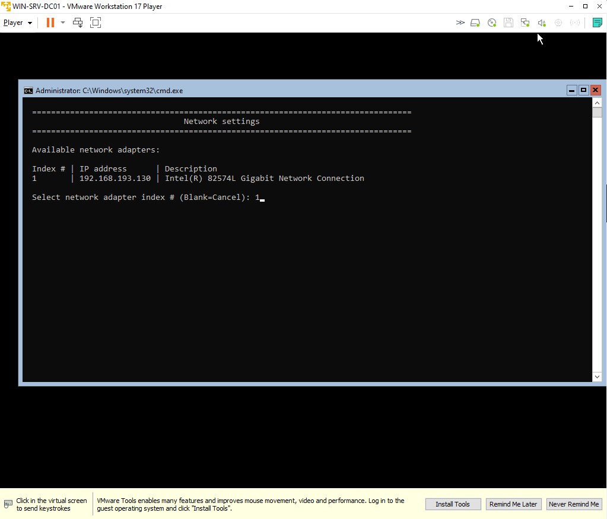
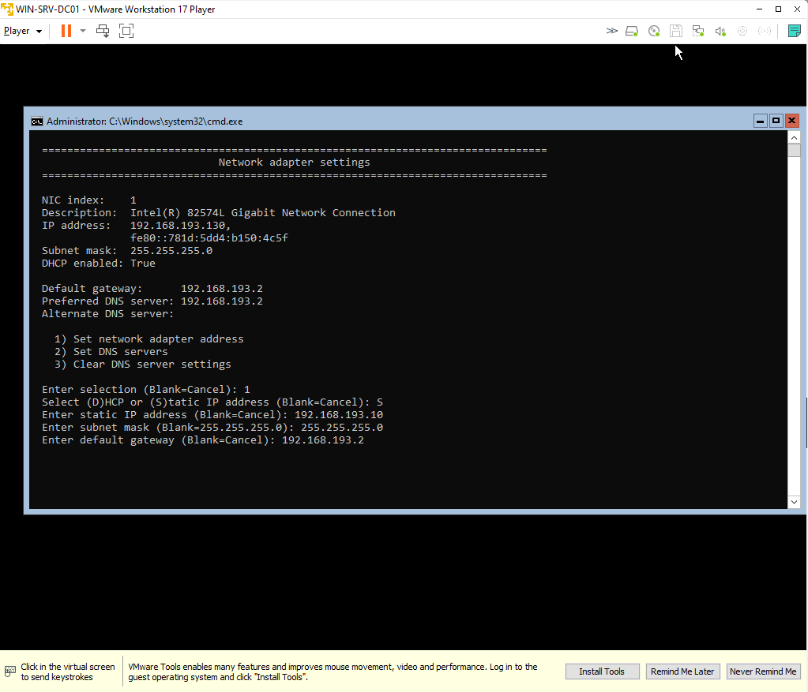
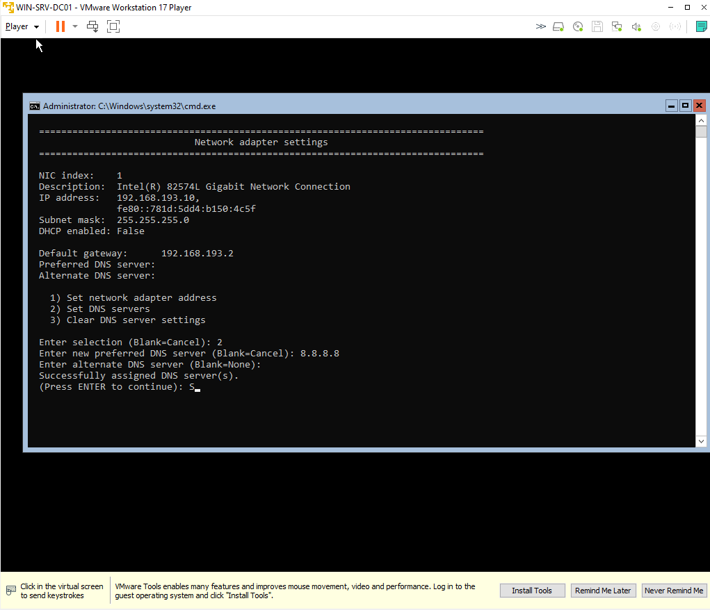
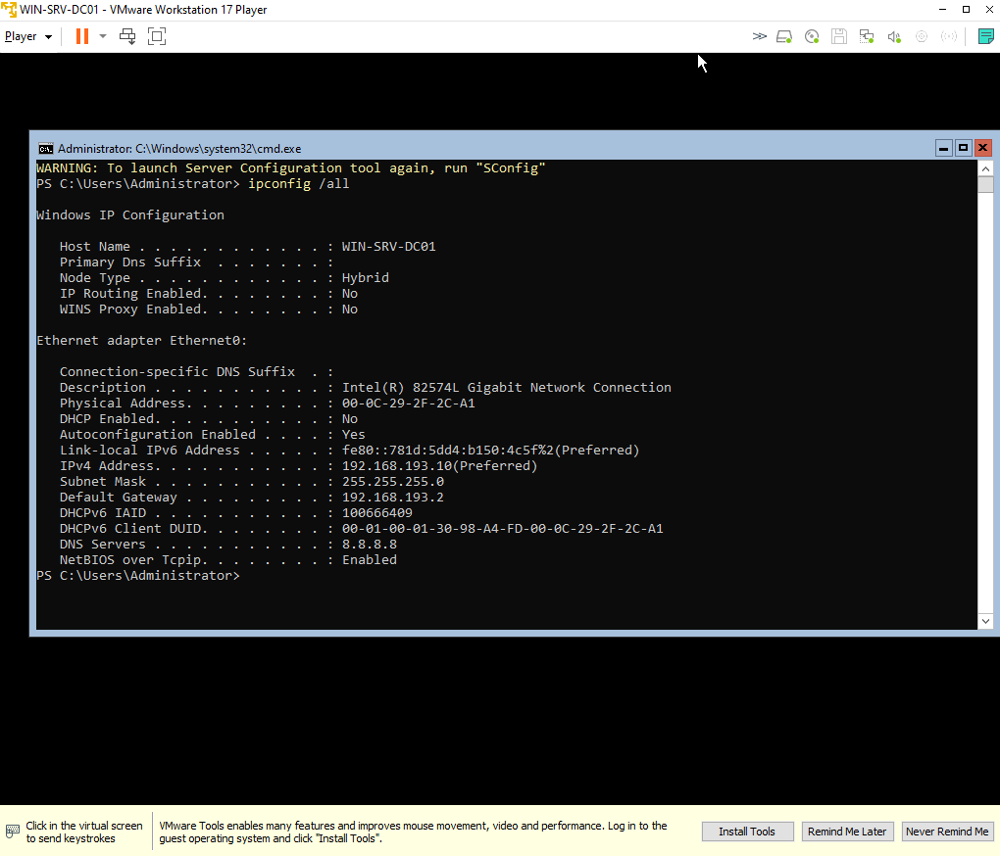
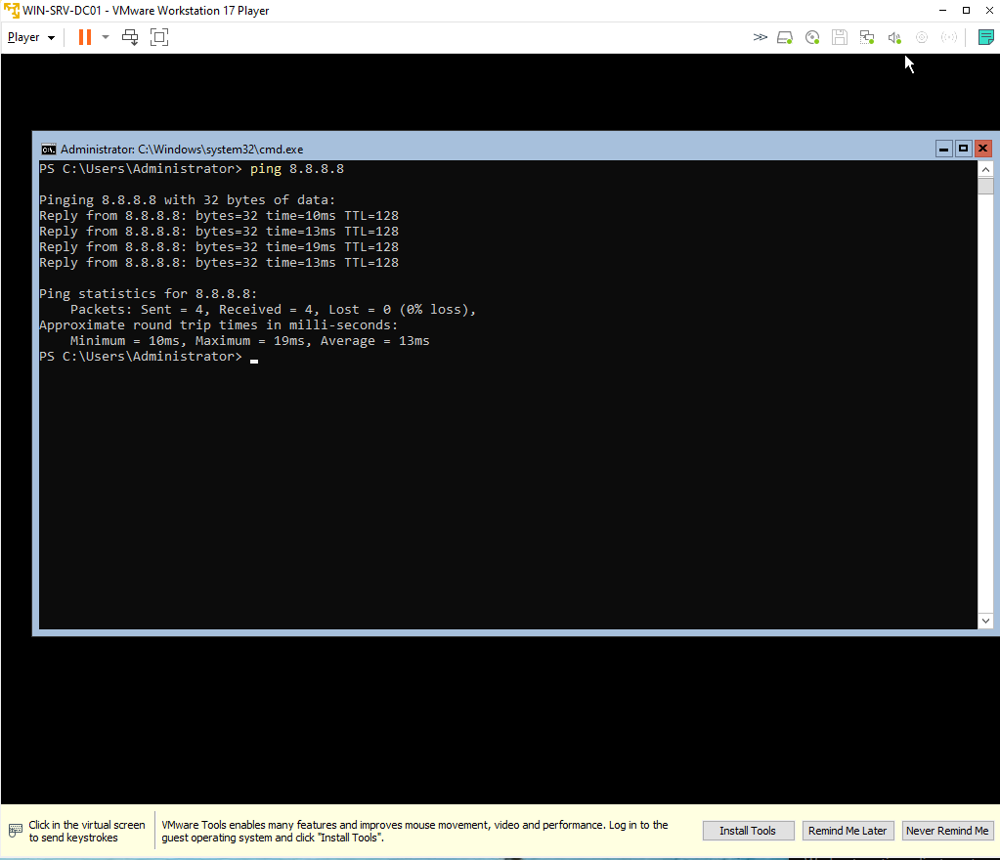
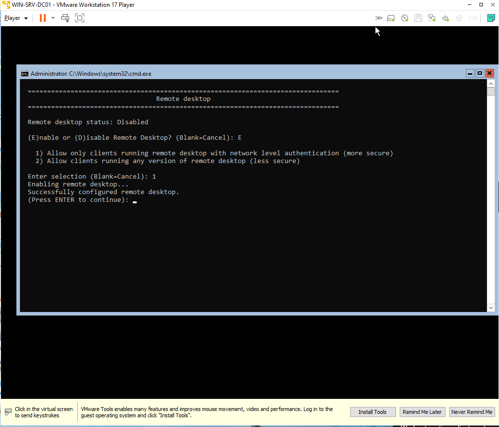
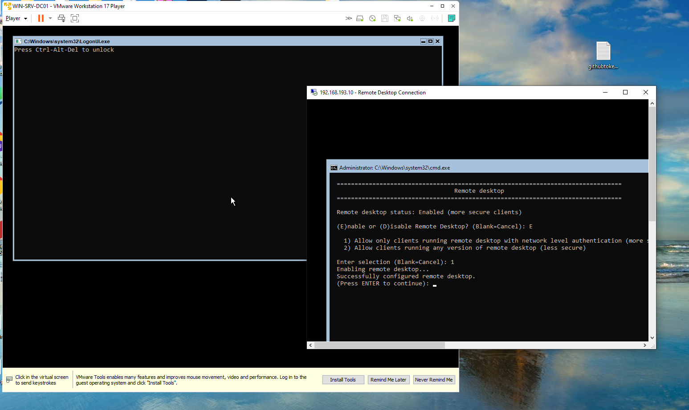

# 🧩 Day 01 – Windows Server Installation & RDP Setup

Installed **Windows Server 2022 Datacenter** on VMware Workstation 17.  
Configured static IP, DNS, and enabled RDP for remote access.

| Step | Description              | Screenshot                                          |
| ---- | ------------------------ | --------------------------------------------------- |
| 10   | Network adapter detected |  |
| 11   | Static IP configured     |                 |
| 12   | DNS set to 8.8.8.8       |                  |
| 13   | Verify with ipconfig     |        |
| 14   | Ping test success        |              |
| 15   | RDP enabled              |          |
| 16   | RDP connected            |      |
